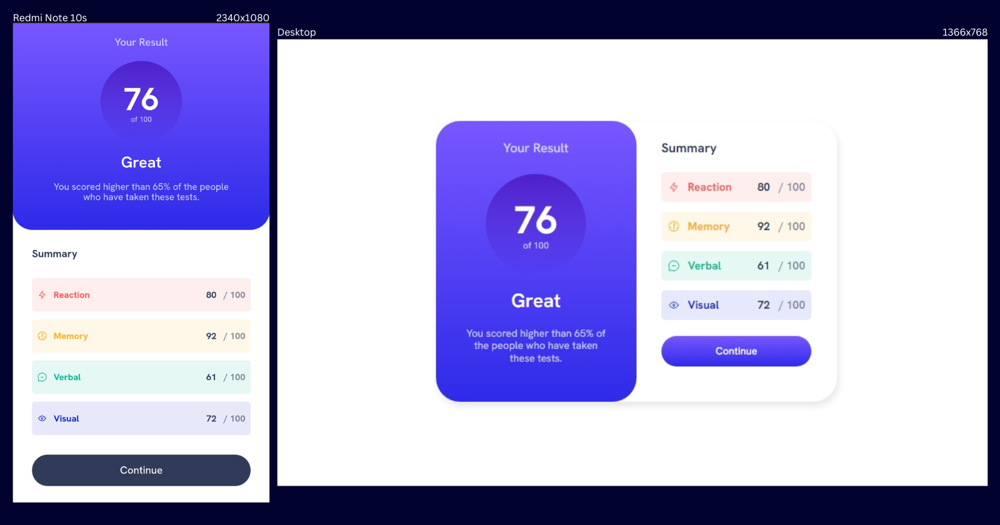

# Frontend Mentor - Results summary component solution

This is a solution to the [Results summary component challenge on Frontend Mentor](https://www.frontendmentor.io/challenges/results-summary-component-CE_K6s0maV). Frontend Mentor challenges help you improve your coding skills by building realistic projects.

## 💻 Table of contents

- [Overview](#overview)
  - [The challenge](#the-challenge)
  - [Screenshot](#screenshot)
  - [Links](#links)
- [My process](#my-process)
  - [Built with](#built-with)
  - [What I learned](#what-i-learned)
- [Author](#author)

**Note: Delete this note and update the table of contents based on what sections you keep.**

## Overview

### 💥 The challenge

Users should be able to:

- View the optimal layout for the interface depending on their device's screen size
- See hover and focus states for all interactive elements on the page
- **Bonus**: Use the local JSON data to dynamically populate the content

### 📷 Screenshot



### 🔗 Links

[](https://github.com/awakeinthedreamstate/results-summary-component-main) [](https://awakeinthedreamstate.github.io/results-summary-component-main/) [](https://www.frontendmentor.io/challenges/results-summary-component-CE_K6s0maV)

### ⚙ Tech Stack

- HTML5
- CSS
- SASS
- Flexbox
- JavaScript

### 📝 What I learned

For this challenge, instead of using the result/score values already provided in the HTML, I wrote some javascript to fetch the data from a json file and display it dynamically. I got practice using asynchronous functions to get data and programmatically writing html using a for loop to display the fetched data. I also opted to use a CSS preprocessor to style the project and went with SASS, which ended up making styling the project much easier. I'm particularly proud of using a combination of a for loop (who'd have thought?) and a variable list within my scss stylesheet to apply background colors to the divs generated by my JS script in an elegant manner.

```css
$scoreCategoryColors: (
  hsl(0, 100%, 67%),
  hsl(39, 100%, 56%),
  hsl(166, 100%, 37%),
  hsl(234, 85%, 45%)
);

@for $i from 1 through 4 {
  #score-category#{$i} {
    background-color: hsl(from nth($scoreCategoryColors, $i) h s l / 10%);
    .score-label {
      color: hsl(from nth($scoreCategoryColors, $i) h s l / 100%);
    }
  }
}
```

```js
for (var i = 0; i < data.length; i++) {
  let icon = data[i].icon;
  let score = data[i].score;
  let category = data[i].category;
  let div = document.createElement("div");
  div.setAttribute("id", `score-category${i + 1}`);
  div.innerHTML =
    '<span class="score-label"> ' +
    category +
    "</span> <span class='score'>" +
    score +
    "</span><span class='score-overall'> / 100</span>";
  results.appendChild(div);
}
```

## 👩‍💻 Developer

[](https://github.com/awakeinthedreamstate) [](https://www.frontendmentor.io/profile/awakeinthedreamstate)
